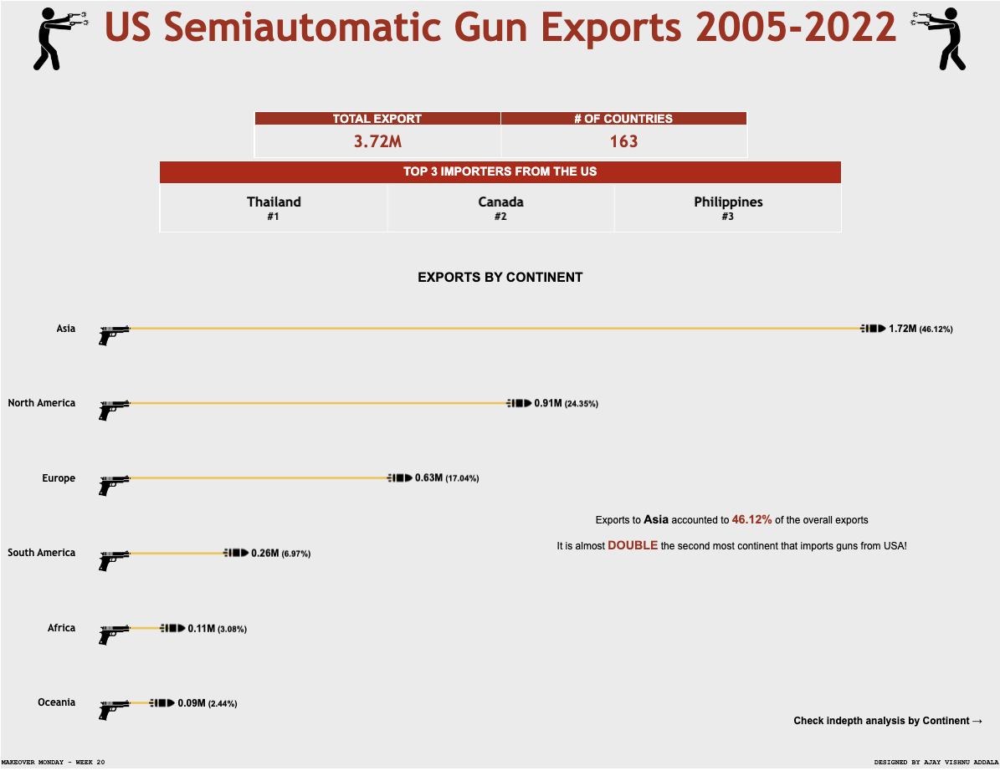

# US Semiautomatic Gun Exports Analysis (2005-2022)

## Overview

This repository contains an analysis of US semiautomatic gun exports from 2005 to 2022. The analysis is visualized through a Tableau dashboard, which provides insights into export volumes, the number of importing countries, top importers, and continent-wise breakdowns.

## Dashboard Features

- **KPIs:** Total export volume, number of countries, and Top 3 importers from the USA.
- **Continent Wise Split:** Visual representation of exports by continent.
- **Detailed Continent Analysis:** 
  - Interactive waffle chart displaying export volumes by continent.
  - Top N countries for each continent with the ability to toggle between 1 to 10 top countries.
  - Export rank of each country.

## Snapshot of the Dashboard



## Tableau Dashboard

You can interact with the Tableau dashboard [here](https://public.tableau.com/app/profile/ajay.vishnu.addala/viz/USSemiautomaticGunExports20052022MOM2024Week20/ByContinent).

## Files in Repository

- Tableau workbook file.
- The dataset used for the analysis.
- Snapshot image of the Tableau dashboard.

## How to Use

1. **Clone the Repository**
    ```sh
    git clone https://github.com/yourusername/US-Semiautomatic-Gun-Exports-Analysis.git
    ```
2. **Open the Tableau Workbook**
    - Ensure you have Tableau Desktop installed.
    - Open the `.twbx` file to view and interact with the dashboard.

3. **Explore the Dataset**
    - The dataset is provided in the file for any additional analysis.

## Contact

For any questions or feedback, feel free to contact me at [your email address].

---

*This project was created as part of the Makeover Monday challenge.*
